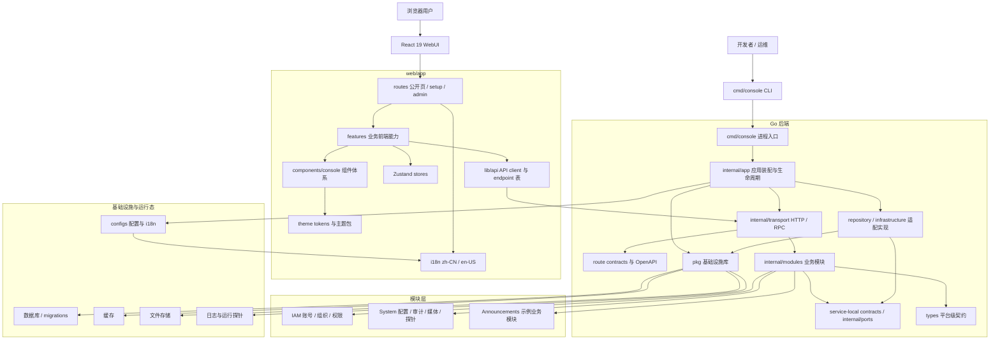

# 项目代号 ｢<ruby>Aoi<rp>（</rp><rt>[深作葵](https://www.anisearch.com/character/43848,aoi-fukasaku)</rt><rp>）</rp></ruby>｣

[](https://github.com/rin721/aoi-server/actions/workflows/ci.yml)
[](https://go.dev/)
[](LICENSE)
[](https://deepwiki.com/rin721/aoi-admin)

Aoi 是一个可运行、可扩展、可二次开发的开源后台管理 / 控制台平台项目。它提供 Go 后端、React 前端、首次安装向导、账号权限、组织租户、系统配置、审计日志、媒体、版本包、运行探针和统一 API 契约生成能力。

<p align="center">
  
</p>

## 标星历史

<a href="https://www.star-history.com/?repos=rin721%2Faoi-admin&type=date&legend=top-left">
 <picture>
   <source media="(prefers-color-scheme: dark)" srcset="https://api.star-history.com/chart?repos=rin721/aoi-admin&type=date&theme=dark&legend=top-left" />
   <source media="(prefers-color-scheme: light)" srcset="https://api.star-history.com/chart?repos=rin721/aoi-admin&type=date&legend=top-left" />
   
</picture>
</a>

## 架构图



## 当前定位

- 主系统提供共享平台能力：账号、组织、权限、配置、审计、API catalog、媒体、版本、健康检查和后台控制台；`announcements` 提供最小端到端业务模块示例。
- 业务扩展统一通过 `internal/modules/<module>` 新增模块，并接入应用装配、route contract、前端 API client、页面、i18n 和测试。
- 前端统一位于 `web/app`，覆盖公开页面、`/setup` 初始化向导和 `/admin` 后台控制台。
- 产品名称、产品码、认证 issuer、请求头、存储 bucket、日志文件名等默认值通过配置和环境变量覆盖，不应写死在业务代码中。

## 任务计划与验收状态

当前平台化重构的任务计划入口是 [开源平台化重构任务计划](docs/maintenance/refactor-roadmap-2026-06-23.md)，用于追踪十个阶段的当前状态、证据入口和下一步动作。最终是否能关闭目标，以 [最终验收差距审计](docs/maintenance/final-acceptance-gap-audit-2026-06-23.md) 为准；对外审查或拆分合并时，参考 [PR 拆分计划](docs/maintenance/pr-split-plan-2026-06-23.md)。发布候选证据集中记录在 [2026-06-23 发布前验收记录](docs/release/preflight-2026-06-23.md)。

当前不能宣告最终完成的主要原因是 Docker 容器真实烟测、生产迁移/备份/密钥/回滚和远端 PR/CI 审查证据仍需目标环境补齐。

## 快速运行

```powershell
go run ./cmd/console server --config=configs/config.example.yaml
$env:VITE_PUBLIC_API_BASE_URL="http://127.0.0.1:9999"
pnpm --dir web/app dev --host 127.0.0.1 --port 3002
```

示例配置会让后端监听 `127.0.0.1:9999`，SQLite 数据位于 `data/`。需要保留本地私有配置时，复制 `configs/config.example.yaml` 到 `configs/config.yaml` 后再按需修改；`configs/config.yaml` 不作为仓库事实来源。首次初始化和后台页面由 React 前端提供。

本地演示环境不提供默认账号或默认密码；请通过 `/setup`、`console init` 或 `iam bootstrap-admin` 显式创建管理员。内置默认数据只包含平台运行所需的字典和参数，说明见 [本地演示环境与示例数据](docs/onboarding/demo-environment.md)。

## 常用验证

```powershell
go test ./internal/config ./internal/transport/http ./types/... -count=1 -mod=readonly
go run ./cmd/console api openapi --output docs/api/openapi.yaml
pnpm --dir web/app typecheck
pnpm --dir web/app lint:i18n
git diff --check
```

完整文档从 [docs/README.md](docs/README.md) 开始。
新开发者路径演练见 [2026-06-23 新开发者路径验证](docs/testing/onboarding-smoke-2026-06-23.md)。
真实进程启动、静态前端托管和关键端点检查见 [本地运行烟测](docs/testing/runtime-smoke-2026-06-22.md)。

## IDE

建议使用以下任意平台进行开发：

[](https://code.visualstudio.com/)

## 测试用浏览器

[](https://www.google.cn/chrome/index.html)
[](https://www.microsoft.com/edge/download)

## 格式规范

* **缩进：** 2 Spaces (当前项目配置) / TAB (模板建议)
* **行尾：** LF
* **引号：** 双引号
* **文件末尾**加空行

## 许可证

MIT，见 [LICENSE](LICENSE)
