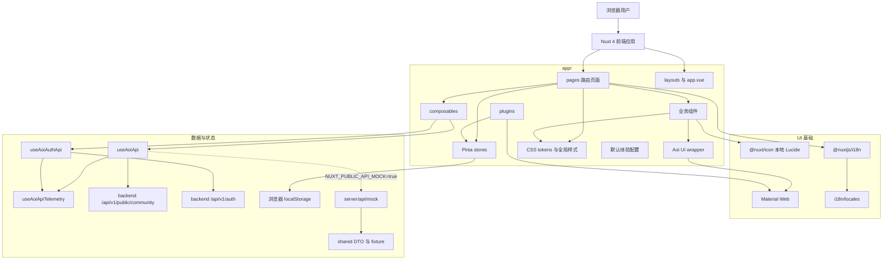

# 项目代号 ｢<ruby>Aoi<rp>（</rp><rt>[深作葵](https://www.anisearch.com/character/43848,aoi-fukasaku)</rt><rp>）</rp></ruby>｣

Aoi Web 是一个 Nuxt 4 前端优先的视频社区应用。项目使用 Vue 3、TypeScript、Pinia、`@nuxtjs/i18n`、`@nuxt/icon`，并通过本地 Aoi wrapper 统一封装 Material Web 组件。

当前应用默认通过 `useAoiApi()` 接入 `backend/internal/modules/community` 公开社区接口，通过 `useAoiAuthApi()` 接入后端账号登录 / 注册接口；Nuxt mock API 仅服务本地演示与调试。浏览器本地偏好 / 缓存只承担匿名 clientId、离线降级和上传草稿元数据。页面覆盖首页发现、分类浏览、搜索、关注动态、视频播放、用户页、观看记录/收藏、上传草稿、登录注册和设置中心；评论列表、评论发布、匿名创作者关注、点赞、收藏、稍后看、观看记录、通知、登录和注册均按当前 API 边界接入。关注动态始终绑定匿名 clientId，视频评论列表按后端 `sort=newest/oldest` 独立请求结果窗口。共享 DTO 与 mock fixture 需贴近后端社区契约。

## 标星历史

<a href="https://star-history.com/#rin721/aoi-web&Date">
 <picture>
   <source media="(prefers-color-scheme: dark)" srcset="https://api.star-history.com/svg?repos=rin721/aoi-web&type=Date&theme=dark" />
   <source media="(prefers-color-scheme: light)" srcset="https://api.star-history.com/svg?repos=rin721/aoi-web&type=Date" />
   
 </picture>
</a>

## 架构图



## IDE

建议使用以下任意平台进行开发：

[](https://code.visualstudio.com/)

## 使用技术

前端开发中所使用了的技术栈有：

[](https://nuxt.com/)
[](https://vuejs.org/)
[](https://vitejs.dev/)
[](https://pinia.vuejs.org/)
[](https://www.typescriptlang.org/)
[](https://github.com/material-components/material-web)
[](https://www.i18next.com/)
[](https://eslint.org/)
[](https://www.npmjs.com/)

## 快速开始

本仓库只使用 pnpm，声明版本为 `pnpm@10.22.0`。

```bash
pnpm install
pnpm dev
```

默认开发服务通常运行在 `http://localhost:3000`。如端口被占用，请以 Nuxt 输出为准。

## 常用命令

| 命令 | 用途 |
| --- | --- |
| `pnpm dev` | 启动本地开发服务 |
| `pnpm typecheck` | 运行 Nuxt / Vue TypeScript 类型检查 |
| `pnpm build` | 构建生产产物 |
| `pnpm preview` | 预览生产构建 |

当前仓库没有提交 `lint` 脚本。

## 目录结构

```text
app/                         前端应用代码
app/components/aoi/          Aoi UI wrapper 组件
app/assets/css/              设计 token 与全局样式
app/composables/             Nuxt composable
app/stores/                  Pinia store 与浏览器本地状态
app/pages/                   Nuxt 页面路由
app/plugins/                 客户端插件与 Material Web 注册
app/config/                  前端运行默认配置
server/api/mock/             Nuxt mock API
shared/                      app 与 mock API 复用的 DTO、fixture
i18n/locales/                `zh-CN`、`en`、`ja` 文案
../AGENTS.md                 聚合仓库长期产品、架构、UI、API 与交互约束
```

不要编辑 `.nuxt/`、`.output/`、`node_modules/` 等生成目录或依赖目录。

## 运行时配置

Nuxt public runtime config 支持以下环境变量：

| 变量 | 默认值 | 说明 |
| --- | --- | --- |
| `NUXT_PUBLIC_API_BASE_URL` | `/api/v1/public/community` | `useAoiApi()` 使用的后端社区 API 基础路径；本地分端口联调可设为 `http://127.0.0.1:9999/api/v1/public/community` |
| `NUXT_PUBLIC_AUTH_API_BASE_URL` | 从 `NUXT_PUBLIC_API_BASE_URL` 派生到 `/api/v1` | `useAoiAuthApi()` 使用的后端账号 API 基础路径；分端口联调时可显式设为 `http://127.0.0.1:9999/api/v1` |
| `NUXT_PUBLIC_API_MOCK` | `false` | 设置为 `true` 时使用 Nuxt mock API；默认使用 `NUXT_PUBLIC_API_BASE_URL` 并消费后端 `result` envelope |

社区页面访问公开社区接口时使用 `useAoiApi()`；登录、注册和后续账号接口使用 `useAoiAuthApi()`，并保持与 `useAoiApiTelemetry()` 的错误诊断兼容。

## 开发约定

- 使用 TypeScript 与 Vue 3 Composition API。
- 保持 2 空格缩进、双引号、LF 换行，Vue/TS 文件不加分号。
- 业务页面和功能组件不要直接使用 `md-*` Material Web 元素；需要新能力时先扩展 `app/components/aoi/`。
- 普通文本链接、卡片链接、标签链接和导航链接统一使用 `AoiLink`。
- 样式优先使用 `app/assets/css/tokens.css` 中的 CSS 变量和 `app/assets/css/main.css` 中的共享布局规则。
- 页面层级以透明表面、低透明边线、轻阴影和稳定媒体比例表达；首页横幅、分类导航、动态卡片和媒体卡片保持轻量边界，贴近清爽的视频社区阅读节奏。
- 新增共享用户可见文案时，同步维护 `i18n/locales/zh-CN.json`、`i18n/locales/en.json` 和 `i18n/locales/ja.json`。
- 登录、注册和账号状态使用社区账号语义。
- 评论、关注、收藏、稍后看、历史、通知等社区状态优先以 `useAoiApi()` 返回的后端 payload 为准；`localStorage` 只保存匿名 clientId 和必要降级缓存，收藏 / 稍后看 / 历史缓存会在后端可用后通过社区 API 回灌并重新读取。
- 浏览器本地 store 必须只在客户端安全 hydrate，并能从损坏的 `localStorage` 恢复。
- 上传草稿状态不要持久化文件字节，只保存文件元数据。

较大的产品、架构、UI、API 或交互变更，应先参考聚合仓库根目录 `../AGENTS.md` 的前端条件规则。

## 验证

- 修改 TypeScript、Vue、路由、composable 或 store 后，运行 `pnpm typecheck`。
- 修改 Nuxt 配置、server route、runtime config 或构建敏感模块后，运行 `pnpm build`。
- 可见 UI 变更应尽量在浏览器中检查桌面和移动端表现。
- 除非后续新增脚本或明确提供命令，不要声称已经完成 lint 验证。

## 测试用浏览器

[](https://www.google.cn/chrome/index.html)
[](https://www.microsoft.com/edge/download)

## 格式规范

* **缩进：** 2 Spaces (当前项目配置) / TAB (模板建议)
* **行尾：** LF
* **引号：** 双引号
* **文件末尾**加空行
* **Vue API 风格：** 组合式 (Composition API)

## 贡献者

- [Rin721](https://github.com/Rin721)
