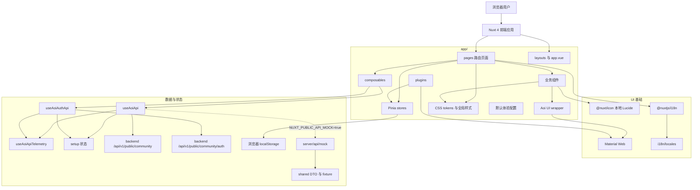

# 项目代号 ｢<ruby>Aoi<rp>（</rp><rt>[深作葵](https://www.anisearch.com/character/43848,aoi-fukasaku)</rt><rp>）</rp></ruby>｣

Aoi Web 是一个 Nuxt 4 前端优先的视频社区应用。项目使用 Vue 3、TypeScript、Pinia、`@nuxtjs/i18n`、`@nuxt/icon`，并通过本地 Aoi wrapper 统一封装 Material Web 组件。

当前应用默认通过 `useAoiApi()` 接入 `backend/internal/modules/community` 公开社区接口，通过 `useAoiAuthApi()` 接入社区账号登录 / 注册接口；Nuxt mock API 只服务本地演示与调试。真实后端由 `GET /api/v1/public/community/status` 暴露 `setup.required/completed/currentStep`，平台初始化未完成时页面显示 setup 引导态而不是伪装成真实内容。浏览器本地偏好 / 缓存只承担匿名 clientId、离线降级和上传草稿元数据。页面覆盖首页发现、分类浏览、搜索、关注动态、视频播放、用户页、观看记录/收藏、上传草稿、登录注册和设置中心；评论列表、评论发布、本人评论编辑 / 删除、动态发布、本人动态编辑 / 删除、创作者关注、点赞、收藏、稍后看、观看记录、通知、投稿、投稿审核结果展示、登录和注册均按当前 API 边界接入。视频分类来自后端系统字典 `community.video.category` 投影，后台控制台维护字典 item，前端只消费 `/categories` 返回值；“全部”只是前端本地虚拟筛选，不作为后端分类 slug。匿名流程绑定浏览器 clientId；社区账号流程使用登录会话派生的账号范围 clientId，并以 `account.displayName` 展示账号作者名。视频评论列表按后端 `sort=newest/oldest` 独立请求结果窗口，动态流按后端 `clientId` 标记归属，前端统一通过 `ownedByCurrentClient` 控制本人操作。上传页在社区账号登录态下先把源文件提交到 `POST /api/v1/public/community/account/submissions/upload`，消费后端真实 `mediaAssetId/displayName/originalName/url/mimeType/sizeBytes` DTO，再映射为投稿所需 `sourceName/sourceSize/sourceType`；页面展示后端返回的 `pending_review`、`approved`、`rejected`、`published`、审核意见、审核时间、受控媒体资产 ID、发布视频 ID 和 `latestVideoJob` 摘要，并用 `latestVideoJob.status/progress/videoId/failureCode/errorMessage/outputPublicUrl` 展示排队、处理中、已发布、失败或取消状态。主系统审核动作由后端 `community_submission:review` 和 `community_video:transcode` 权限接口处理，后台创建异步视频任务后由本地 FFmpeg worker 或通用云 webhook 回调完成发布；前端不伪造审核、转码或播放源状态。共享 DTO 与 mock fixture 需贴近后端社区契约。

## 标星历史

<a href="https://star-history.com/#rin721/aoi-web&Date">
 <picture>
   <source media="(prefers-color-scheme: dark)" srcset="https://api.star-history.com/svg?repos=rin721/aoi-web&type=Date&theme=dark" />
   <source media="(prefers-color-scheme: light)" srcset="https://api.star-history.com/svg?repos=rin721/aoi-web&type=Date" />
   
 </picture>
</a>

## 架构图



## IDE

建议使用以下任意平台进行开发：

[](https://code.visualstudio.com/)

## 使用技术

前端开发中所使用了的技术栈有：

[](https://nuxt.com/)
[](https://vuejs.org/)
[](https://vitejs.dev/)
[](https://pinia.vuejs.org/)
[](https://www.typescriptlang.org/)
[](https://github.com/material-components/material-web)
[](https://www.i18next.com/)
[](https://eslint.org/)
[](https://www.npmjs.com/)

## 快速开始

本仓库只使用 pnpm，声明版本为 `pnpm@10.22.0`。

```bash
pnpm install
pnpm dev
```

默认开发服务通常运行在 `http://localhost:3000`。如端口被占用，请以 Nuxt 输出为准。

## 常用命令

| 命令 | 用途 |
| --- | --- |
| `pnpm dev` | 启动本地开发服务 |
| `pnpm typecheck` | 运行 Nuxt / Vue TypeScript 类型检查 |
| `pnpm build` | 构建生产产物 |
| `pnpm preview` | 预览生产构建 |

当前仓库没有提交 `lint` 脚本。

## 目录结构

```text
app/                         前端应用代码
app/components/aoi/          Aoi UI wrapper 组件
app/assets/css/              设计 token 与全局样式
app/composables/             Nuxt composable
app/stores/                  Pinia store 与浏览器本地状态
app/pages/                   Nuxt 页面路由
app/plugins/                 客户端插件与 Material Web 注册
app/config/                  前端运行默认配置
server/api/mock/             Nuxt mock API
shared/                      app 与 mock API 复用的 DTO、工具；mock fixture 只放在 shared/mocks
i18n/locales/                `zh-CN`、`en`、`ja` 文案
../AGENTS.md                 聚合仓库长期产品、架构、UI、API 与交互约束
```

不要编辑 `.nuxt/`、`.output/`、`node_modules/` 等生成目录或依赖目录。

## 运行时配置

Nuxt public runtime config 支持以下环境变量：

| 变量 | 默认值 | 说明 |
| --- | --- | --- |
| `NUXT_BACKEND_ORIGIN` | 空 | 可选 Nuxt / Nitro 代理目标；默认不启用同源代理，只有显式填写后才把 `/api/v1/**` 转发到后端 |
| `NUXT_PUBLIC_API_BASE_URL` | 开发模式默认为 `http://localhost:9999/api/v1/public/community` | `useAoiApi()` 使用的后端社区 API 基础路径；本地直连 CORS 时使用绝对后端地址，启用 `NUXT_BACKEND_ORIGIN` 代理时由 Nuxt 自动改为相对路径 |
| `NUXT_PUBLIC_AUTH_API_BASE_URL` | 从 `NUXT_PUBLIC_API_BASE_URL` 派生到 `/api/v1` | `useAoiAuthApi()` 使用的社区账号 API 基础路径；本地直连 CORS 时建议与页面同用 `localhost` 主机，避免 `localhost` / `127.0.0.1` 混用影响 Cookie SameSite |
| `NUXT_PUBLIC_AUTH_CSRF_COOKIE_NAME` | `community_csrf` | 社区账号写请求读取的浏览器可见 CSRF cookie 名称，应与后端社区认证配置保持一致 |
| `NUXT_PUBLIC_AUTH_CSRF_HEADER_NAME` | `X-Community-CSRF-Token` | 社区账号 `POST` / `PATCH` / `DELETE` 请求注入的 CSRF header 名称，应与后端社区认证配置保持一致 |
| `NUXT_PUBLIC_API_MOCK` | `false` | 设置为 `true` 时内容接口走 `/api/mock/*`，社区账号登录 / 注册 / 会话走 `/api/mock/auth/*`；默认使用后端公开社区接口和社区账号接口并消费 `result` envelope |

社区页面访问公开社区接口时使用 `useAoiApi()`；登录、注册、会话和账号接口使用 `useAoiAuthApi()`，并保持与 `useAoiApiTelemetry()` 的错误诊断兼容。真实后端若返回 `messageKey=api.setup.required`，错误 payload 的 `setup` 字段会传递给页面；首页和设置高级页必须显示初始化状态，不把该状态降级为静态内容。Nuxt mock `/api/mock/status` 返回 `mode=mock` 与 setup 已完成状态，仅表示本地演示边界。
API Token 是后台自动化、脚本或机器客户端访问后台接口的凭证，不是 Nuxt 浏览器社区登录凭证，也不要写入 `NUXT_PUBLIC_*`、Pinia store 或 `localStorage`。社区账号真实模式依赖浏览器 Cookie 会话：登录 / 注册接口由后端设置 `community_access`、`community_refresh` 等社区会话 Cookie，`useAoiApi()` 和 `useAoiAuthApi()` 使用 `credentials: "include"` 发送 Cookie，`POST` / `PATCH` / `DELETE` 写请求在客户端能读到 `community_csrf` 时自动带上 `X-Community-CSRF-Token`。
本地分端口联调默认使用浏览器直连 CORS：前端页面使用 `http://localhost:3000` 时，API 地址也使用 `http://localhost:9999`，后端必须使用精确前端来源配置 CORS，例如 `APP_CORS_ALLOW_ORIGINS=http://localhost:3000,http://127.0.0.1:3000` 与 `APP_CORS_ALLOW_CREDENTIALS=true`，不能把凭证请求与 `*` 来源混用。社区账号写请求会自动带上后端认证配置中的 CSRF header；当前后端装配会把该 header 补入 CORS allow headers，若前面还有网关或代理，也要同步放行。浏览器 Cookie 还要求页面和 API 使用一致主机，避免 `localhost` / `127.0.0.1` 混用；只有明确需要同源代理时才设置 `NUXT_BACKEND_ORIGIN`。
真实 API 模式只展示后端数据库和系统字典中的真实内容。新初始化后端只内置系统字典 code `community.video.category`，不内置具体视频分类 item，也不会写入 `Aoi Alpha`、`Layout Notes`、`Color Note` 等演示视频、创作者、动态、评论或弹幕；分类需由后台“社区分类”或系统字典管理维护。首页公告来自后端公告模块的已发布公告，没有已发布公告时显示为空；这些演示内容只保留在 `NUXT_PUBLIC_API_MOCK=true` 的 Nuxt mock 边界内。

## 开发约定

- 使用 TypeScript 与 Vue 3 Composition API。
- 保持 2 空格缩进、双引号、LF 换行，Vue/TS 文件不加分号。
- 业务页面和功能组件不要直接使用 `md-*` Material Web 元素；需要新能力时先扩展 `app/components/aoi/`。
- 普通文本链接、卡片链接、标签链接和导航链接统一使用 `AoiLink`。
- 样式优先使用 `app/assets/css/tokens.css` 中的 CSS 变量和 `app/assets/css/main.css` 中的共享布局规则。
- 页面层级以透明表面、低透明边线、轻阴影和稳定媒体比例表达；首页横幅、分类导航和媒体卡片保持轻量边界，贴近清爽的视频社区阅读节奏。
- 参考 `kirakira.moe` 时只吸收设计语言：白底、粉色强调、轻公告条、清晰分类导航、稳定 16:9 媒体卡片、紧凑元信息、短促 hover/focus 状态和桌面 / 移动双端网格节奏；不要复制其品牌图形、文案、图片或固定布局。
- 分类入口、通知卡片和设置卡片复用 `AoiSurface` / `AoiInfoCard` 的轻边界；动态卡片保留在关注流等专门页面，不在首页展示。列表型内容按内容宽度和稳定网格排列，不把单个轻入口拉成整行横幅。视频列表在真实数据较少时使用 `VideoGrid` 的稀疏布局，PC 端保持可读卡片宽度，Mobile 单条视频使用单列，避免空库联调或刚发布一条内容时出现过窄卡片和大片空白。
- 移动端底部主导航使用轻量浮动 dock；页面、表单、按钮、链接和长内容区必须保留底部避让与 `scroll-margin`，避免导航遮挡尾部内容或输入区域。
- 页面入口保持视频社区产品流程，围绕首页、分类、搜索、关注、播放、用户、通知、投稿和设置组织导航与路由。
- 新增共享用户可见文案时，同步维护 `i18n/locales/zh-CN.json`、`i18n/locales/en.json` 和 `i18n/locales/ja.json`。
- 登录、注册和账号状态使用普通社区账号语义；页面、store、shared DTO、mock fixture 和 i18n 只表达用户资料、会话、创作者、互动、收藏、历史、通知与投稿等社区平台流程。
- 浏览器侧注册请求只提交用户名、显示名、邮箱和密码；社区公开认证入口返回前端会话需要的最小字段。
- `useAuthSessionStore().refreshSession()` 会对同一浏览器会话内的并发探测做 in-flight 去重；页面、插件和 store 不要绕过该入口直接重复请求会话接口。
- 评论、动态、关注、收藏、稍后看、历史、通知等社区状态优先以 `useAoiApi()` 返回的后端 payload 为准；`localStorage` 只保存匿名 clientId 和必要降级缓存，收藏 / 稍后看 / 历史缓存会在后端可用后通过社区 API 回灌并重新读取。评论和动态编辑 / 删除只对后端返回 `ownedByCurrentClient=true` 的当前匿名或账号内容开放，前端不得用作者名或本地列表位置推断所有权。
- 投稿草稿只提交标题、简介、分类、标签、可见性和文件元数据；新草稿的 `categorySlug` 默认为空，分类下拉只来自 `/categories` 或显式 mock 模式的 mock API。分类为空或真实接口返回空分类时禁用提交，不写死 `design`、`home` 或其他生产分类默认值。上传页的真实账号投稿会先上传源文件字节，后端返回 `mediaAssetId/displayName/originalName/url/mimeType/sizeBytes`，前端只把这些字段映射成投稿元数据，不保存文件字节。审核通过后后台通过“创建转码任务”进入异步处理，前端账号投稿列表只根据后端 `latestVideoJob` 摘要展示待审核、已通过、排队中、处理中、已发布、失败或已取消状态，不在浏览器伪造 FFmpeg、云回调或 HLS 结果。
- Mock API 只用于演示与本地调试；凡是页面展示真实联调结果，必须能从 `/status` 的 `mode=go`、setup 状态、端点清单和实际接口响应追踪到后端数据来源，且不得在真实 API 模式回退展示 mock/demo fixture。mock 数据只允许放在 `server/api/mock/**` 和 `shared/mocks/**`，业务页面、store 和普通 composable 不得导入 mock fixture，也不得直接访问 `/api/mock`。
- 浏览器本地 store 必须只在客户端安全 hydrate，并能从损坏的 `localStorage` 恢复。
- 上传草稿状态不要持久化文件字节，只保存文件元数据。

较大的产品、架构、UI、API 或交互变更，应先参考聚合仓库根目录 `../AGENTS.md` 的前端条件规则。

## 验证

- 修改 TypeScript、Vue、路由、composable 或 store 后，运行 `pnpm typecheck`。
- 修改 Nuxt 配置、server route、runtime config 或构建敏感模块后，运行 `pnpm build`。
- 修改登录、注册、会话、账号状态、页面入口、shared DTO、mock fixture 或 i18n 后，从仓库根目录运行 `powershell -ExecutionPolicy Bypass -File scripts/check-frontend-community-boundary.ps1`。
- 修改 `useAoiApi()`、社区 DTO、后端社区模块或联调配置后，从仓库根目录运行 `powershell -ExecutionPolicy Bypass -File scripts/check-frontend-community-api-smoke.ps1`；脚本会用临时 SQLite 启动后端，完成最小首次管理员初始化，通过系统字典 API 创建测试视频分类，再验证公开首页、分类、视频、搜索、匿名评论与动态编辑删除、匿名互动通知、账号源文件上传、投稿创建、主系统审核队列、审核通过、创建异步视频处理任务、任务列表 / 详情、账号投稿 `latestVideoJob` 的 queued / running / succeeded / failed 摘要、公开视频 HLS source、社区账号注册、账号动态编辑删除、账号关注动态、账号观看历史和账号通知链路。若本机缺少 `ffmpeg` / `ffprobe`，本地 HLS 转码 smoke 应明确失败原因，并用云 webhook / mock provider 路径补足任务状态闭环。
- 修改首页、分类页、搜索页、视频播放页、用户页、通知页、历史页、收藏页、上传页、登录注册页、设置高级页、内容网格或真实数据展示状态后，从仓库根目录运行 `powershell -ExecutionPolicy Bypass -File scripts/check-frontend-community-page-smoke.ps1`；脚本会用临时 SQLite 启动真实社区 API、完成最小 setup、通过系统字典 API 创建测试视频分类、隔离启动 Nuxt dev server，并在 `NUXT_PUBLIC_API_MOCK=false` 下保存 `register/login-session/login-error/login/home/category/search/video/creator/creator-account/following/history/collections/notifications/upload/settings` 的桌面全页截图与移动端 `390x844` 真实视口截图。该检查聚焦社区数据和页面结构，覆盖注册、登出、错误登录、重新登录、关注 / 取消关注 / 再关注、账号态动态、收藏、稍后看、观看历史、通知已读、真实 API 状态，以及上传页真实投稿后失败态、发布进度和已发布入口的 `latestVideoJob` 可见状态；视频页会隔离外部媒体字节，移动端会检查横向溢出、失败态和底部 dock 内容可达性。
- 可见 UI 变更应尽量在浏览器中检查桌面和移动端表现。
- 除非后续新增脚本或明确提供命令，不要声称已经完成 lint 验证。

## 测试用浏览器

[](https://www.google.cn/chrome/index.html)
[](https://www.microsoft.com/edge/download)

## 格式规范

* **缩进：** 2 Spaces (当前项目配置) / TAB (模板建议)
* **行尾：** LF
* **引号：** 双引号
* **文件末尾**加空行
* **Vue API 风格：** 组合式 (Composition API)

## 贡献者

- [Rin721](https://github.com/Rin721)
